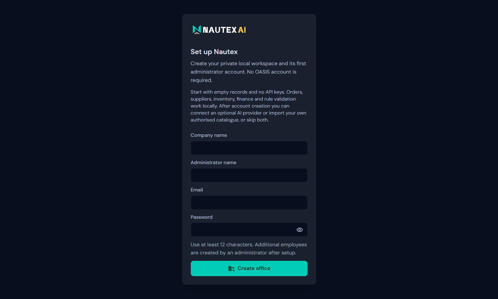
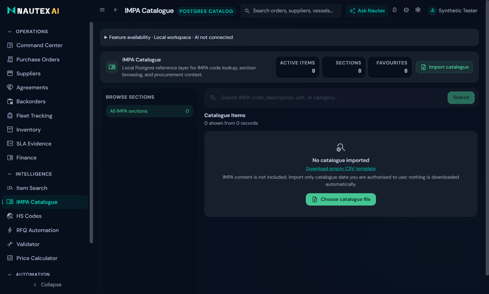

# Nautex Community

Local Windows software for ship-chandler procurement, inventory and operations, with optional user-configured AI assistance. Copyright 2026 Zlatin Gorov; an OASIS AI project.

**Source release: `v0.3.14-source.1`. The Windows installer is pending verification and is not available for download.**

This repository contains the sanitised application source under AGPL-3.0-only. Native dependency redistribution review and clean-Windows installation qualification remain incomplete. No installer or native-materials archive is published. GitHub's “Source code (zip)” contains source, not an installer. See the [release status and verified results](docs/RELEASE_STATUS.md).

## Windows installation status

Windows 11 x64 is the intended supported target; clean-machine qualification is pending, and Windows 10 compatibility is unqualified. The privately tested package contains Electron, its Node runtime, the backend, PostgreSQL, migration tooling and Microsoft's Visual C++ x64 prerequisite installer. Its design does not require end users to install Node, Docker or PostgreSQL separately. Administrator consent may be needed for the Microsoft prerequisite. Allow at least 4 GB disk and 4 GB RAM for initial evaluation; workload sizing has not been benchmarked.

Developers can follow the [build instructions](docs/BUILD.md) in a separate checkout and test profile. Building locally does not clear native binaries for redistribution. At first launch, create your local company/workspace and administrator with a password of at least 12 characters. No OASIS account is required. Skip AI and catalogue import to start locally, or configure your own provider and authorised data.

The locally built candidate is unsigned. Follow your organisation's software trust policy; do not disable Windows protections. Clean Windows installation, prerequisite UAC/reboot and SmartScreen behaviour require the [pending test procedure](docs/CLEAN_WINDOWS_TEST.md). Signing remains optional.

## What works without an API key?

Local record workflows, calculations, catalogue imports/search, deterministic RFQ processing and rule validation remain available. Classification, AI extraction/drafting and some agent actions depend on configured providers. The [complete module matrix](docs/MODULE_REQUIREMENTS.md) covers all 17 navigation modules, Ask Nautex and Settings. Each module exposes concise availability in the app.

Use Settings → AI providers to connect, choose models, test, change or remove a key. [Provider setup](docs/PROVIDERS.md) explains supported providers, costs, privacy and failure recovery. DeepSeek Flash is the recommended economical starting point for text tasks; Google Gemini is the supported alternative. Neither recommendation is a claim of live qualification or universal accuracy.

## Bring your own data

There are no business records, personal profiles, owner API keys or IMPA catalogue contents in the release. Nautex does not download restricted catalogues. Obtain any catalogue independently with appropriate rights, then use **IMPA Catalogue → Import catalogue**. The [CSV template](public/templates/catalogue.csv) contains headers only. [Catalogue instructions](docs/CATALOGUE.md) describe the schema. There is no bundled demo workspace.

## Storage, updates and support

Community data lives in `%APPDATA%\Nautex Community`, outside the installation. Upgrades reuse this community profile and create recovery material where the existing migration workflow requires it. Uninstall preserves data. Private Nautex profiles are never automatically adopted or migrated. Use protected backups; recovery copies may contain confidential records and credentials and are not public support attachments. Automatic update and crash-upload endpoints are disabled in this candidate.

Fleet lookup/map tiles and optional mailbox/web enrichment need internet access independently of AI. No paid AIS feed, OCR engine, accounting certification or catalogue licence is included. Jev advice is experimental and uses a separate TypeSafe account. External-provider availability may change. Live-provider qualification is pending; the synthetic smoke-test plan and cost bounds are documented.

Support is best-effort through the [repository issue tracker](https://github.com/zpointai/nautex/issues). There is no promise of ongoing development or free individual assistance. Never attach live databases, credentials, recovery archives or private business documents to public issues.

## Licence and source

Owner-authored code is **AGPL-3.0-only**; see [LICENSE](LICENSE) and [NOTICE](NOTICE). Commercial use is permitted under the licence. AGPL does not require publishing every private internal change, but conveying covered binaries and providing modified software for remote network interaction carry source obligations. This summary does not replace the licence.

The [native component/source review](docs/THIRD_PARTY.md) documents acquired materials and remaining binary redistribution blockers. This source release includes build instructions, lockfiles, notices and component/source manifests; it does not include native executables or dependency archives. Packaging scripts generate the matching application-source ZIP for Help → Corresponding source and licences and Settings → About / Legal. A modified network deployment must offer source matching its running version. A future installer release must include its matching source and cleared dependency materials.
