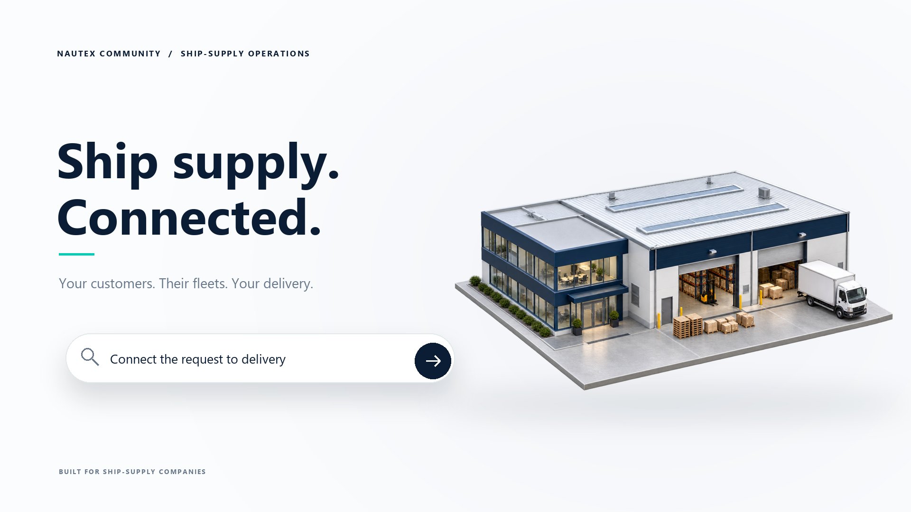

# Community overview

[Download/watch the MP4](https://github.com/zpointai/nautex/releases/download/v0.3.14-source.2/Nautex-Community-Overview.mp4) · [release assets and checksums](https://github.com/zpointai/nautex/releases/tag/v0.3.14-source.2)

28-second 1080p/60 fps animation with original procedural sound. Silent MP4, storyboard and editable project are supplied as separate release assets. It adapts the owner's v5 design using the sanitised Community screenshot. The warehouse and vessel are conceptual illustrations; the app capture is real, with no catalogue rows and AI disconnected. AI requires the user's own configured provider account and separately billed usage.

All 1,680 frames decoded without errors; twelve encoded frames were inspected. Sound measured -23.9 dB mean and -12.4 dB peak. The editable project includes its provenance, renderer, audio generator, selected assets, licence and validation report. No paid media generation was used.

The video is suitable for announcing the **source release**. It explicitly says the Windows installer is pending verification. It must not be presented as an available installer download. Household installation photographs and their personal reflections remain private.

## Suggested LinkedIn post for the current release

I'm sharing Nautex Community, an open-source project for ship-supply procurement and local operations.

The source is available on GitHub under AGPL-3.0-only. Nautex supports local orders, supplier records, inventory and finance, with optional AI using your own provider account. No API keys, business records or IMPA catalogue content are bundled; users can import their own authorised catalogue.

Here's a short overview. The Windows installer is still pending redistribution and installation verification, so this announcement is for the source release. Feedback from developers and ship-supply professionals is welcome.

https://github.com/zpointai/nautex

The owner may post this text and video on LinkedIn. No LinkedIn post has been made automatically. Replace the installer-status sentence only when a cleared installer release is actually available.
